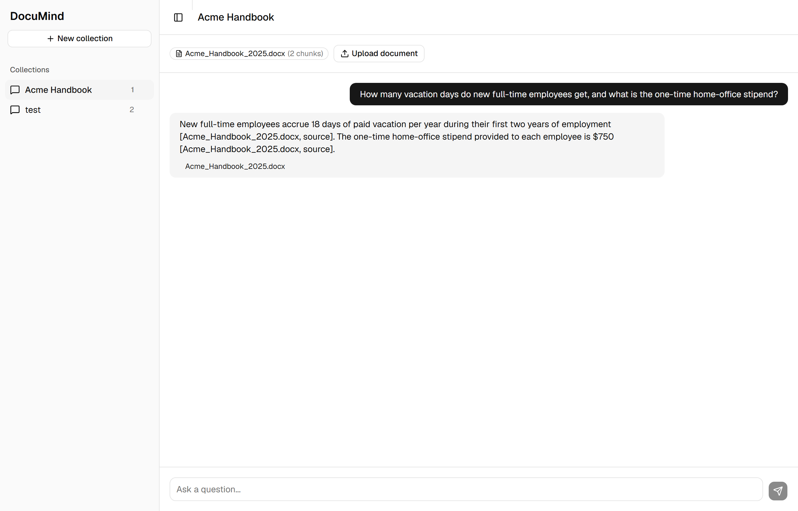
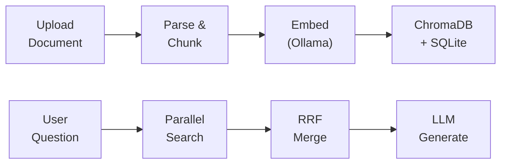

# DocuMind

Privacy-first RAG document Q&A engine. Upload PDFs, Word docs, or spreadsheets and chat with them — entirely offline, powered by local models via [Ollama](https://ollama.com). Nothing leaves your machine.

[](LICENSE)
[](https://www.python.org/downloads/)
[](https://nodejs.org/)



## Features

- **Multi-format** — PDF, DOCX, and XLSX with automatic parsing.
- **Hybrid search** — Semantic (embeddings) + keyword (BM25) fused with Reciprocal Rank Fusion.
- **Source citations** — Inline `[document, p. N]` references, validated against retrieved chunks.
- **Streaming answers** — Token-by-token responses over Server-Sent Events.
- **Collections** — Group documents and keep separate chat histories.
- **100% local** — All parsing, embedding, and generation runs offline.

## Tech Stack

| Layer | Technology |
|-------|-----------|
| Frontend | React 19 + Vite + TypeScript + TailwindCSS + ShadCN |
| Backend | FastAPI + Uvicorn |
| Vector DB | ChromaDB (cosine) |
| Keyword DB | SQLite FTS5 (BM25) |
| LLM | Qwen3:8B via Ollama |
| Embeddings | nomic-embed-text (768-dim) |
| Parsing | pdfplumber, python-docx, openpyxl |

## Quick Start

**Prerequisites:** Python 3.10+, Node.js 18+, and [Ollama](https://ollama.com). 8 GB RAM minimum (16 GB recommended), ~15 GB disk for models.

```bash
# 1. Clone and pull models
git clone https://github.com/Mr-Robot-1216/DocuMind.git
cd DocuMind
ollama pull qwen3:8b
ollama pull nomic-embed-text

# 2. Backend
cd backend
python -m venv venv
source venv/bin/activate        # Windows: venv\Scripts\activate
pip install -r requirements.txt

# 3. Frontend
cd ../frontend
npm install
```

Then run each in its own terminal:

```bash
ollama serve                                          # Ollama
uvicorn app.main:app --reload --port 8000             # Backend (from backend/, venv active)
npm run dev                                            # Frontend (from frontend/)
```

Open **http://localhost:5173** to start. API docs live at **http://localhost:8000/docs**.

## How It Works



**Ingestion:** documents are parsed, split into 800-character chunks (100-char overlap), embedded with `nomic-embed-text`, and stored in ChromaDB (semantic) plus SQLite FTS5 (keyword).

**Query:** the question is embedded and searched against both stores in parallel. Results are merged with Reciprocal Rank Fusion, and the top chunks are passed to `qwen3:8b`, which streams an answer with validated citations.

## API

Full interactive docs at `http://localhost:8000/docs`.

| Method | Endpoint | Description |
|--------|----------|-------------|
| `GET` | `/collections` | List collections |
| `POST` | `/collections` | Create a collection |
| `DELETE` | `/collections/{id}` | Delete a collection |
| `POST` | `/collections/{id}/documents` | Upload a document |
| `GET` | `/collections/{id}` | Get a collection with its documents |
| `POST` | `/chat` | Stream an answer (SSE) |
| `GET` | `/collections/{id}/messages` | Get chat history |
| `GET` | `/health` | Health check |

`POST /chat` takes `{ "collection_id": "...", "message": "..." }` and streams `token`, `sources`, and `done` events.

## Testing

```bash
cd backend
pytest                      # all tests
pytest --cov=app tests/     # with coverage
```

38+ tests cover parsing, chunking, embeddings, retrieval, citations, and FTS5.

## Project Structure

```
DocuMind/
├── backend/          # FastAPI app
│   ├── app/
│   │   ├── api/      # routes
│   │   ├── core/     # business logic
│   │   ├── db/       # ChromaDB + SQLite clients
│   │   └── schemas/  # pydantic models
│   └── tests/
├── frontend/         # React + Vite
│   └── src/
└── docs/
```

## Roadmap

- [ ] Cross-encoder re-ranking
- [ ] Retrieval evaluation harness
- [ ] Relevance thresholding
- [ ] Export chat (PDF / Markdown)
- [ ] Docker Compose
- [ ] Dark mode

## Contributing

1. Fork and create a branch: `git checkout -b feature/my-feature`
2. Make your changes with tests.
3. Commit using [Conventional Commits](https://www.conventionalcommits.org/): `git commit -m "feat: add feature"`
4. Push and open a pull request.

Python follows PEP 8; TypeScript follows the project ESLint config.

## License

[MIT](LICENSE)
